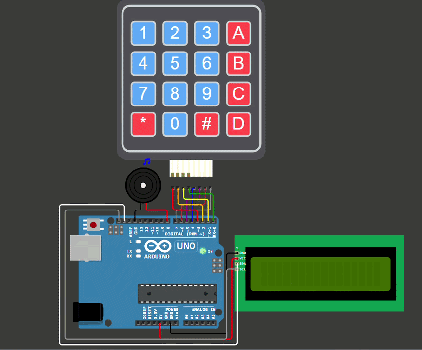

# 🎹 Digital Piano (with LCD)

  A small digital piano built with Arduino, a 4×4 matrix keypad, a buzzer, and a 16×2 I2C LCD.

## ✨ Features

-  16 musical notes
-  4×4 matrix keypad
-  Real-time sound using `tone()`
-  Custom note graphics using LCD custom characters
-  Scrolling note patterns 
-  Note animation for each button
-  Non-blocking scrolling using `millis()`

## 🛠️ Hardware

- Arduino
- 4×4 Matrix Keypad
- 16×2 I2C LCD
- Buzzer

## ❓ How It Works

### Playing Music with LCD Graphics

once any key is pushed or held, the note animation is displayed on the LCD along with its sound from the buzzer. 
...

### Scrolling Demo 
...
after 5 seconds from the last button press event, scrolling demo begins. 

## ✨ Circuit Simulation

  

Wokwi Simulation link:
> *(https://wokwi.com/projects/472401340838196225)*

## ✨ Author & License

**Parnian Ghorbani**

This project is open-source and available for learning and educational purposes however; If you use this project or its ideas in your own work, please consider mentioning this repository :)
